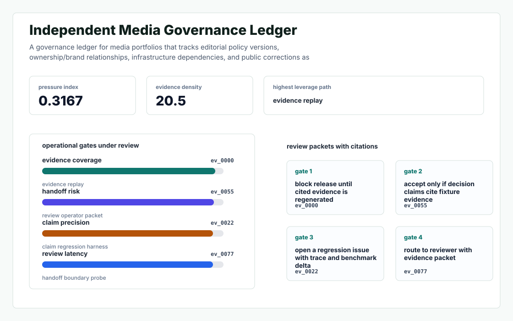
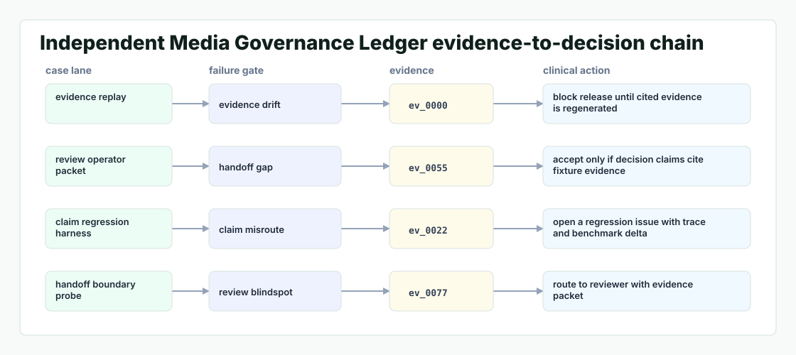

# Independent Media Governance Ledger

A governance ledger for media portfolios that tracks editorial policy versions, ownership/brand relationships, infrastructure dependencies, and public corrections as verifiable timelines.



## Why it exists

independent media operators need durable governance and provenance systems that prove editorial independence, ownership, and platform resilience over time.

The project is intentionally built as a local replay harness instead of a slide. It creates fixtures, plants realistic failure modes, produces citation-locked evidence, and turns the result into a dashboard a reviewer can inspect without credentials or hosted services.

## What is inside

- Deterministic fixture generation for the company-specific risk surface.
- Strategy code in `src/independent_media_governance_ledger/strategy.py` with project-specific scoring and visual evidence.
- Citation-locked reports where every decision claim points to a generated evidence ID.
- Two regenerated visual artifacts: `outputs/project_working.svg` and `outputs/evidence_map.svg`.
- A portable demo pack with JSON, CSV, Markdown, HTML, SVG, benchmark, and test artifacts.



## Signals it measures

- `independent coverage`
- `media risk`
- `operators precision`
- `durable latency`

## Failure modes it plants

- independent drift
- media gap
- operators misroute
- durable blindspot

## Run it locally

```bash
uv sync
uv run independent-media-governance-ledger all
uv run pytest -q
uv run ruff check .
```

## Outputs worth opening

- `outputs/dashboard.html`
- `outputs/project_working.svg`
- `outputs/evidence_map.svg`
- `outputs/operator_brief.md`
- `outputs/decision_report.md`
- `outputs/strategy_model.json`
- `outputs/demo_pack.zip`

## Sources

- https://w-worldmedia.com/about/

## Boundary

Everything runs locally against synthetic fixtures. There are no credentials, no customer records, no outreach files, and no hosted API dependency.
